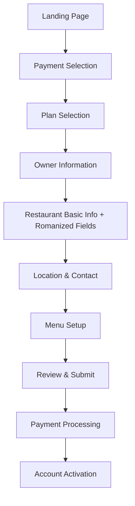
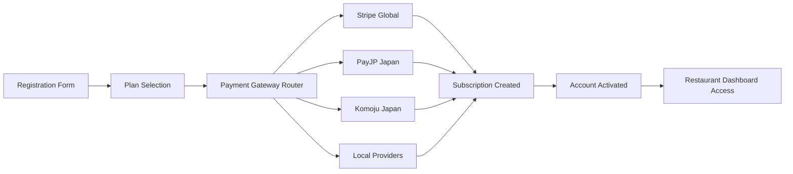

# Restaurant Management App - Pricing Strategy & Architecture

## Current Issues Analysis

### User Management Layout Problems
- Two separate registration forms in the same interface (UserManagement + RestaurantOwnerRegistration)
- Inconsistent UI patterns and data structures
- No payment gate integration
- Missing romanized fields in RestaurantOwnerRegistration
- Complex 5-tab registration flow that may overwhelm users

## Unified Restaurant Owner Registration Flow



## Pricing Strategy for Japanese Restaurant Management Apps

Based on market research of Japanese SaaS pricing models and local business customs:

### Tier 1: スタータープラン (Starter Plan)
- **Price:** ¥2,980/month (~$20 USD)
- **Target:** Small restaurants, cafes, bars (1-20 seats)
- **Features:**
  - Basic restaurant profile with Japanese + Romanized fields
  - Menu management (up to 50 items)
  - Order notifications
  - 2 languages support (Japanese + English)
  - Basic analytics
  - QR code menu generation

### Tier 2: スタンダードプラン (Standard Plan)
- **Price:** ¥5,980/month (~$40 USD)
- **Target:** Medium restaurants (20-50 seats)
- **Features:**
  - Everything in Starter
  - Unlimited menu items
  - Reservation management
  - 5 languages support (JP, EN, KO, ZH, TH)
  - Advanced analytics
  - Social media integration
  - Custom QR code branding
  - Email/LINE notifications

### Tier 3: プレミアムプラン (Premium Plan)
- **Price:** ¥12,800/month (~$85 USD)
- **Target:** Large restaurants, chains
- **Features:**
  - Everything in Standard
  - Multi-location support
  - All languages (12+ including MS, ID, VI, ES, PL, RO)
  - Custom branding and white-label options
  - API access for integrations
  - Priority support (24/7)
  - Advanced integrations (POS systems, delivery platforms)
  - Detailed customer analytics

## Multi-Country Pricing Differentiation

### Regional Pricing Strategy

Based on GDP per capita, local market conditions, and competitive landscape:

#### Tier A Countries (High GDP)
- **Japan, South Korea**
- **Multiplier:** 1.0x (Base pricing)
- **Reasoning:** High GDP, established SaaS market, premium service expectations

#### Tier B Countries (Medium GDP)
- **Malaysia, Thailand**
- **Multiplier:** 0.6x (60% of base price)
- **Reasoning:** Growing economies, increasing digital adoption, price-sensitive market

#### Tier C Countries (Lower GDP)
- **Indonesia, Vietnam, Philippines**
- **Multiplier:** 0.4x (40% of base price)
- **Reasoning:** Emerging markets, high price sensitivity, volume-based strategy

#### Tier D Countries (European Emerging)
- **Poland:** 0.7x (70% of base price) - Higher purchasing power in EU
- **Romania:** 0.5x (50% of base price) - Lower local purchasing power

### Pricing Matrix (Monthly Subscription)

| Plan     | Japan   | S.Korea | Malaysia | Thailand | Indonesia | Vietnam | Poland  | Romania |
|----------|---------|---------|----------|----------|-----------|---------|---------|---------|
| Starter  | ¥2,980  | ₩35,000 | RM75     | ฿600     | Rp285,000 | ₫450,000| zł63    | RON45   |
| Standard | ¥5,980  | ₩70,000 | RM150    | ฿1,200   | Rp570,000 | ₫900,000| zł126   | RON90   |
| Premium  | ¥12,800 | ₩150,000| RM320    | ฿2,560   | Rp1,220,000| ₫1,920,000| zł269 | RON192  |

## Payment Gate Integration Plan

### Recommended Payment Providers by Region

#### Japan
- **Primary:** Stripe (international cards, Apple Pay, Google Pay)
- **Secondary:** PayJP (local Japanese cards, convenience store payments)
- **Tertiary:** Komoju (comprehensive local payment methods including bank transfers)

#### Southeast Asia
- **Primary:** Stripe (international coverage)
- **Secondary:** Omise (Thailand, Japan focused)
- **Tertiary:** Regional providers (GrabPay, ShopeePay, etc.)

#### Europe
- **Primary:** Stripe (comprehensive EU coverage)
- **Secondary:** Adyen (enterprise-grade)
- **Tertiary:** Local bank transfers and SEPA

### Payment Gateway Architecture



## Implementation Roadmap

### Phase 1: Foundation (Weeks 1-2)
- [ ] Consolidate user registration into single unified flow
- [ ] Add romanized fields to all restaurant forms
- [ ] Implement basic payment gate selection logic
- [ ] Set up Stripe integration for core markets

### Phase 2: Core Features (Weeks 3-4)
- [ ] Integrate PayJP for Japanese local payments
- [ ] Implement subscription management system
- [ ] Add plan selection and upgrade/downgrade functionality
- [ ] Create payment success/failure handling

### Phase 3: Regional Expansion (Month 2)
- [ ] Implement regional pricing logic
- [ ] Add multi-currency support
- [ ] Integrate local payment methods per region
- [ ] Add country-specific tax handling

### Phase 4: Advanced Features (Month 3+)
- [ ] Multi-location support for restaurant chains
- [ ] Advanced analytics and reporting
- [ ] API development for third-party integrations
- [ ] White-label solutions for enterprise clients

## Technical Considerations

### Database Schema Updates Required
```sql
-- Add subscription and payment tables
CREATE TABLE subscriptions (
  id UUID PRIMARY KEY DEFAULT gen_random_uuid(),
  restaurant_id UUID REFERENCES restaurants(id),
  plan_type TEXT NOT NULL,
  status TEXT NOT NULL,
  current_period_start TIMESTAMPTZ,
  current_period_end TIMESTAMPTZ,
  stripe_subscription_id TEXT,
  created_at TIMESTAMPTZ DEFAULT NOW()
);

CREATE TABLE payments (
  id UUID PRIMARY KEY DEFAULT gen_random_uuid(),
  subscription_id UUID REFERENCES subscriptions(id),
  amount INTEGER NOT NULL,
  currency TEXT NOT NULL,
  status TEXT NOT NULL,
  payment_method TEXT,
  stripe_payment_intent_id TEXT,
  created_at TIMESTAMPTZ DEFAULT NOW()
);
```

### Security Considerations
- PCI DSS compliance through payment processor
- Secure webhook handling for payment status updates
- Encrypted storage of sensitive restaurant data
- GDPR compliance for European markets
- Local data residency requirements per country

### Localization Requirements
- Currency formatting per region
- Tax calculation per jurisdiction
- Local payment method names and flows
- Compliance with local business registration requirements
- Customer support in local languages

## Success Metrics

### Key Performance Indicators (KPIs)
- **Conversion Rate:** Registration to paid subscription
- **Monthly Recurring Revenue (MRR)** per region
- **Customer Acquisition Cost (CAC)** by marketing channel
- **Churn Rate** by plan tier and region
- **Average Revenue Per User (ARPU)** by country
- **Payment Success Rate** by payment method

### Target Goals (Year 1)
- 1,000 paying restaurants in Japan
- 500 paying restaurants in Southeast Asia
- 200 paying restaurants in Europe
- 85% payment success rate across all regions
- <5% monthly churn rate
- $50,000 MRR by end of year 1

This pricing strategy balances market penetration with revenue optimization while respecting local economic conditions and payment preferences.